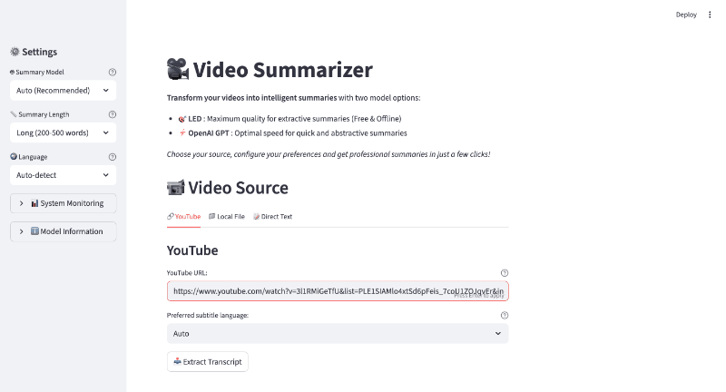

# AI Video Summarizer

<div align="center">
  
  <p><em>Modern web application for video summarization</em></p>
</div>

**Transform your videos into intelligent summaries** with advanced AI models and comprehensive evaluation metrics.

## Features

-  **LED Model**: High-quality, free, offline summarization (up to 16K tokens)
-  **OpenAI Integration**: Fast, multi-language summaries
-  **Quality Evaluation**: Automatic quality scoring and metrics  
-  **System Monitoring**: Real-time performance tracking
-  **Multi-source Input**: YouTube, local files, direct text
-  **Modern Interface**: Beautiful Streamlit web app

## Quick Start

### Option 1: Automated Installation
```bash
# Clone the repository
git clone https://github.com/faridgnank02/video-summarizer.git
cd video-summarizer

# Run automated installer (includes spaCy models)
python scripts/install.py

# Activate environment
source video-summarizer-env/bin/activate

# Configure OpenAI (optional)
echo "OPENAI_API_KEY=your-key-here" >> .env

# Launch application
python scripts/launch.py
```

### Option 2: Manual Installation
```bash
# Create virtual environment
python -m venv video-summarizer-env
source video-summarizer-env/bin/activate  # Linux/Mac
# video-summarizer-env\Scripts\activate    # Windows

# Install dependencies
pip install -r requirements.txt

# Download spaCy models for evaluation
python -m spacy download en_core_web_sm
python -m spacy download fr_core_news_sm

# Launch application
streamlit run src/ui/streamlit_app.py
```

## Model Comparison

| Feature | LED | OpenAI GPT |
|---------|----------------|------------|
| **Cost** | 🆓 Free | 💰 Pay per use |
| **Internet** | ❌ Offline | ✅ Required |
| **Speed** | ⏱️ 5-10s | ⚡ 2-3s |
| **Quality** | 🌟🌟🌟🌟 | 🌟🌟🌟🌟🌟 |
| **Languages** | 🇺🇸 English (best) | 🌍 Multi-language |
| **Long texts** | ✅ Specialized | ✅ Good |
| **Style** | 📝 Extractive | 🎨 Abstractive |

###  **LED Advantages**
- **100% Free**: No usage costs or API keys required
- **Privacy**: All processing happens locally
- **Offline**: Works without internet connection
- **GPU Accelerated**: Optimized for Apple M1/M2/M3 chips
- **Long Documents**: Handles up to 16K tokens natively

### **OpenAI Advantages**
- **Speed**: 3-5x faster than LED
- **Languages**: Excellent multi-language support
- **Style**: More natural, abstractive summaries
- **Consistency**: Reliable quality across content types

## System Requirements

### Minimum
- Python 3.8+
- 8GB RAM
- 2GB disk space

### Recommended (for LED model)
- Python 3.12
- 16GB RAM
- Apple M1/M2/M3 (GPU acceleration)
- 4GB disk space

## Usage

### 1. YouTube Videos
```
1. Paste YouTube URL
2. Select subtitle language
3. Click "Extract Transcript"
4. Choose model and settings
5. Generate summary
```

### 2. Local Files
```
- Supported: MP4, AVI, MOV, MP3, WAV, M4A
- Feature in development (requires Whisper)
```

### 3. Direct Text
```
1. Paste your text
2. Add optional title
3. Select model and length
4. Generate summary
```

## Configuration

### Model Settings (`config/model_config.yaml`)
```yaml
models:
  led:
    device: auto          # auto, mps, cuda, cpu
    model_name: allenai/led-base-16384
    generation_config:
      num_beams: 4
      length_penalty: 2.0
      max_length: 512
  
  openai:
    model_name: gpt-4
    fallback_model: gpt-3.5-turbo
```

### Application Settings (`.env`)
```bash
OPENAI_API_KEY=your-openai-api-key
PYTORCH_MPS_HIGH_WATERMARK_RATIO=0.0  # For M1 Macs
```

## Quality Metrics

The system automatically evaluates summary quality using a **hybrid evaluation framework**:

### BERTScore (0-1) - Weight: 50%
- **Measurement**: Semantic similarity via sentence transformers
- **Method**: `paraphrase-multilingual-MiniLM-L12-v2` model
- **Threshold**: >0.8 = Excellent, >0.6 = Good, >0.4 = Fair, <0.4 = Poor

### Compression Quality (0-1) - Weight: 20%
- **Measurement**: Intelligent compression with density analysis
- **Method**: Adaptive ratios based on text length + information density
- **Optimal Ratios**: Short texts (30-70%), Medium (10-30%), Long (5-15%)

### Hybrid Word Overlap (0-1) - Weight: 30%
- **Measurement**: Named Entity Recognition + Keywords
- **Method**: 60% spaCy NER + 40% TF-IDF Keywords
- **Entities**: PERSON, ORG, GPE, DATE, MONEY, PRODUCT, EVENT, etc.
- **Fallback**: Keywords-only if spaCy unavailable

### Overall Quality Score
**Formula**: 0.5 × BERTScore + 0.2 × Compression + 0.3 × WordOverlap

### Quality Indicators
-  **Excellent** (0.8-1.0): High-quality, semantically accurate summary
-  **Good** (0.6-0.8): Good quality with minor issues
-  **Acceptable** (0.4-0.6): Usable but may need refinement
-  **Poor** (<0.4): Significant quality issues detected

##  Advanced Features

### GPU Acceleration (Apple Silicon)
The LED model automatically uses your M1/M2/M3 GPU via Metal Performance Shaders:
- **1.5x faster** than CPU processing
- **Lower power consumption**
- **Better thermal management**

### Quality Assessment
- Automatic transcript quality detection
- User warnings for low-quality content  
- Model recommendations based on content type
- Fallback strategies for problematic texts

### System Monitoring
- Real-time CPU, memory, and disk usage
- Processing time tracking
- Model performance metrics
- Usage statistics

## Troubleshooting

### LED Model Issues
```bash
# Check GPU availability (Mac)
python -c "import torch; print(torch.backends.mps.is_available())"

# Force CPU mode
# Edit config/model_config.yaml: device: cpu

# Check model loading
python -c "from src.models.led_model import LEDSummarizer; print('OK')"
```

### OpenAI Issues
```bash
# Verify API key
echo $OPENAI_API_KEY

# Test connection
python -c "import openai; print(openai.Model.list())"
```

### Common Issues
| Problem | Solution |
|---------|----------|
| Out of memory | Use shorter input texts or OpenAI model |
| Slow performance | Enable GPU acceleration or use OpenAI |
| Poor quality | Check transcript quality score and try other model |
| Import errors | Reinstall dependencies: `pip install -r requirements.txt` |
| **spaCy model missing** | `python -m spacy download en_core_web_sm` |
| **Evaluation errors** | `python -m spacy download fr_core_news_sm` |

## Documentation

- [Quick Start Guide](docs/QUICKSTART.md)
- [Quick Start Guide (English)](docs/QUICKSTART_EN.md)
- [M1 Optimization Guide](docs/M1_OPTIMIZATION.md)  
- [Technical Documentation](docs/TECHNICAL_DOCUMENTATION.md)

## Contributing

1. Fork the repository
2. Create a feature branch: `git checkout -b feature-name`
3. Make your changes and test thoroughly
4. Commit: `git commit -m "Add feature-name"`
5. Push: `git push origin feature-name`
6. Create a Pull Request

## License

This project is licensed under the MIT License - see the [LICENSE](LICENSE) file for details.

## Acknowledgments

- **Hugging Face**: LED model and transformers library
- **OpenAI**: GPT models and API
- **Streamlit**: Beautiful web interface framework
- **YouTube Transcript API**: Video transcript extraction

## Project Stats

- **Models**: 2 (LED + OpenAI)
- **Languages**: Multi-language support
- **Quality Metrics**: 4 comprehensive scores
- **Platforms**: macOS, Linux, Windows
- **GPU Support**: Apple Silicon, NVIDIA CUDA
- **Status**: ✅ Production Ready

---
