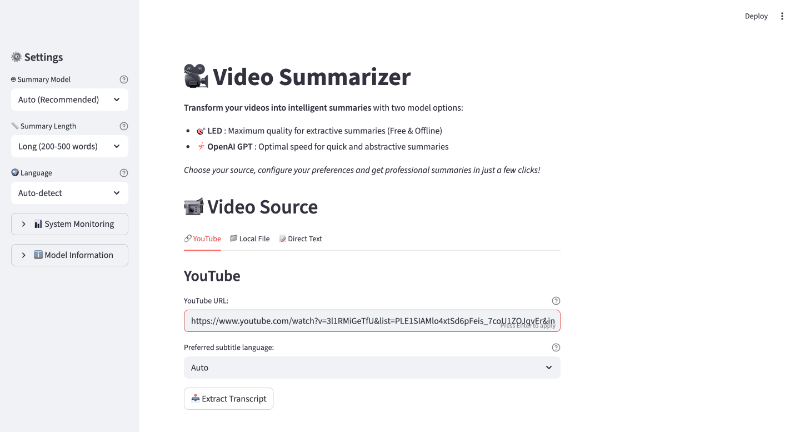

# AI Video Summarizer

<div align="center">
  
  <p><em>Modern web application for video summarization</em></p>
</div>

**Transform your videos into intelligent summaries** with local AI models and fast cloud processing.

## ✨ What's New in This Version

In this new version of the project, I decided to **completely replace the LED model with Ollama's local LLMs** (particularly Qwen3). This decision was driven by several key factors:

-  **Performance**: The LED model was significantly slow (30-200s per summary) and consumed excessive memory (8-16GB RAM)
- **Local LLM Exploration**: I wanted to explore the capabilities of modern local large language models as a free, private alternative
- **Speed Improvement**: Ollama with Qwen3/Gemma models provides much faster inference (3-10s) while maintaining quality
- **Memory Efficiency**: Reduced memory footprint from 8-16GB to 2-4GB with Ollama models
- **Simplicity**: Streamlined architecture focusing on two excellent options: local (Ollama) and cloud (OpenAI)

The evaluation system has also been simplified, removing automatic quality scoring to provide a cleaner, faster user experience.

## Features

-  **Dual AI Model Strategy**: 
   - 🆕 **Ollama (Local LLMs)**: Qwen3, Gemma3, Mistral - Fast, free, offline, private
   - ⚡ **OpenAI Integration**: GPT-4/3.5-turbo for maximum speed and quality
-  **System Monitoring**: Real-time performance and memory tracking
-  **Multi-source Input**: YouTube, local files, direct text
-  **Modern Interface**: Clean Streamlit web app
-  **Memory Management**: Smart model loading and cache clearing

## Quick Start

### Option 1: Automated Installation
```bash
# Clone the repository
git clone https://github.com/faridgnank02/video-summarizer.git
cd video-summarizer

# Run automated installer
python scripts/install.py

# Activate environment
source video-summarizer-env/bin/activate

# Configure OpenAI (optional)
echo "OPENAI_API_KEY=your-key-here" >> .env

# Launch application
python scripts/launch.py
```

### Option 2: Manual Installation
```bash
# Create virtual environment
python -m venv video-summarizer-env
source video-summarizer-env/bin/activate  # Linux/Mac
# video-summarizer-env\Scripts\activate    # Windows

# Install dependencies
pip install -r requirements.txt

# Download spaCy models for evaluation
python -m spacy download en_core_web_sm
python -m spacy download fr_core_news_sm

# Launch application
streamlit run src/ui/streamlit_app.py
```

## Models Comparison

| Feature | **Ollama (Qwen3/Gemma)** 🆕 | **OpenAI** |
|---------|---------------------------|-----------|
| **Cost** | 🆓 Free | 💰 Pay-per-use |
| **Internet** | ❌ Offline | ✅ Required |
| **Speed** | ⚡ 3-10s | ⚡⚡ 2-5s |
| **Quality** | 🌟🌟🌟🌟 | 🌟🌟🌟🌟🌟 |
| **Languages** | 🌍 Multi-language |  Multi-language |
| **Long texts** | ✅ Excellent (8K+) | ✅ Excellent |
| **Setup** | 🔧 Easy | 🎯 Instant |
| **RAM** | 2-4GB | N/A |
| **Privacy** | 🔒 100% Local | ☁️ Cloud-based |

### **Ollama Advantages**
- **Multiple Models**: Choose from Qwen3, Gemma3, Mistral, Llama, GPT-OSS
- **CPU Optimized**: No GPU required, runs on any Mac/Linux/Windows
- **Fast Inference**: 3-10s per summary
- **100% Free**: No API costs, no usage limits
- **Privacy First**: All processing happens locally on your machine
- **Easy Setup**: `ollama pull qwen3:1b` and you're ready
- **Memory Efficient**: Only 2-4GB RAM (vs 8-16GB for LED)

### **OpenAI Advantages**
- **Speed**: Fastest option (2-5s)
- **Languages**: Excellent multi-language support
- **Style**: Most natural, abstractive summaries
- **Consistency**: Reliable quality across content types
- **No Local Resources**: Zero memory/CPU usage on your machine

### 📖 **Quick Start with Ollama**

```bash
# Install Ollama
curl -fsSL https://ollama.com/install.sh | sh

# Start server
ollama serve

# Download recommended model
ollama pull gemma3:1b  # Fast and efficient (or gemma3:1b)

# Test integration
python -c "from src.models.ollama_model import OllamaSummarizer; print('✅ Ollama ready!')"
```

**Why Qwen3/Gemma3?**
- Optimized for instruction following
- Better summary quality than larger models
- Extremely fast (3-10s vs 30-200s with LED)
- Minimal memory usage (2-4GB vs 8-16GB with LED)

## System Requirements

### Minimum
- Python 3.8+
- 4GB RAM
- 2GB disk space
- Internet connection (for OpenAI or Ollama model download)

### Recommended (for Ollama)
- Python 3.10+
- 8GB RAM
- 5GB disk space (for Ollama models)
- Any CPU (Apple Silicon, Intel, AMD)

## Usage

### 1. YouTube Videos
```
1. Paste YouTube URL
2. Select subtitle language
3. Click "Extract Transcript"
4. Choose model and settings
5. Generate summary
```

### 2. Local Files
```
- Supported: MP4, AVI, MOV, MP3, WAV, M4A
- Feature in development (requires Whisper)
```

### 3. Direct Text
```
1. Paste your text
2. Add optional title
3. Select model and length
4. Generate summary
```

## Configuration

### Model Settings (`config/model_config.yaml`)

```yaml
models:
  ollama:
    model_name: gemma3:1b      # Or qwen, gpt-oss, deepseek-r1...
    base_url: http://localhost:11434
    temperature: 0.3
    max_tokens: 800
  
  openai:
    model_name: gpt-4
    fallback_model: gpt-3.5-turbo
    temperature: 0.7
    max_tokens: 500
```

### Application Settings (`.env`)

```bash
OPENAI_API_KEY=your-openai-api-key
OLLAMA_BASE_URL=http://localhost:11434  # Optional, default value
```

## Usage Notes

**In this new version**, the quality evaluation metrics have been removed from the UI to provide a cleaner, faster experience. The focus is now on generating high-quality summaries quickly using either local Ollama models or OpenAI's API.

The LED model is no longer included because:
- It was slow (30-200s per summary)
- It consumed too much memory (8-16GB RAM)
- Ollama provides better performance with modern LLMs (3-10s, 2-4GB RAM)
- Local LLM exploration offers more flexibility and future-proofing

## Troubleshooting

### Ollama Issues

```bash
# Check if Ollama is running
curl http://localhost:11434/api/tags

# Start Ollama server
ollama serve

# Check available models
ollama list

# Pull recommended model
ollama pull qwen3:1b
```

### OpenAI Issues

```bash
# Verify API key
echo $OPENAI_API_KEY

# Test connection
python -c "import openai; print('✅ OpenAI configured')"
```

### Common Issues

| Problem | Solution |
|---------|----------|
| Ollama not found | Install Ollama: `curl -fsSL https://ollama.com/install.sh \| sh` |
| Out of memory | Use smaller model (qwen3:1b) or OpenAI |
| Slow performance | Try qwen3:1b or gemma3:1b for faster inference |
| Poor quality | Try different model or adjust temperature in config |
| Import errors | Reinstall: `pip install -r requirements.txt` |

## Documentation

- [Quick Start Guide (Français)](docs/QUICKSTART.md)
- [Quick Start Guide (English)](docs/QUICKSTART_EN.md)
- [Technical Documentation](docs/TECHNICAL_DOCUMENTATION.md)
- [LED Removal Summary](docs/LED_REMOVAL_SUMMARY.md) - Details about migrating from LED to Ollama
- **🚀 [Production Deployment Guide](DEPLOYMENT.md)** - Deploy to Docker Hub & AWS
- **⚡ [Quick Deployment](QUICKSTART_DEPLOYMENT.md)** - Deploy in 3 steps

## 🐳 Production API

This project now includes a production-ready REST API optimized for cloud deployment:

### Quick Deploy

```bash
# 1. Test locally with Docker
docker-compose up -d

# 2. Push to Docker Hub
./scripts/docker_build_push.sh latest

# 3. Deploy to AWS ECS Fargate
./scripts/deploy_aws.sh
```

### API Features
- ✅ **FastAPI** with OpenAPI docs
- ✅ **Docker optimized** (< 500MB image)
- ✅ **AWS ECS Fargate** ready (serverless)
- ✅ **Cost efficient** (~5-15$/month)
- ✅ **Auto-scaling** capable
- ✅ **Health checks** & monitoring

See [DEPLOYMENT.md](DEPLOYMENT.md) for complete guide.

## Project Stats

- **Models**: 2 (Ollama + OpenAI)
- **Languages**: Multi-language support (French, English, Spanish, German, etc.)
- **Platforms**: macOS, Linux, Windows
- **Local LLM**: Qwen3, Gemma3, Mistral via Ollama
- **Production**: Docker + AWS ECS ready
- **Status**: ✅ Production Ready

---
